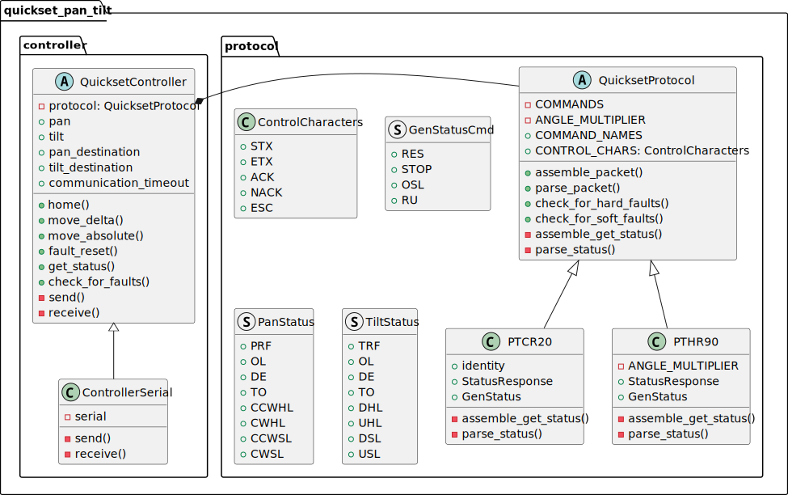

# Class Diagram

Note that most private methods are not shown. Only private abstract methods and their concrete implementations are shown.

<picture>
    <source media="(prefers-color-scheme: dark)" srcset="./class-diagram-dark-mode.svg">
    
</picture>